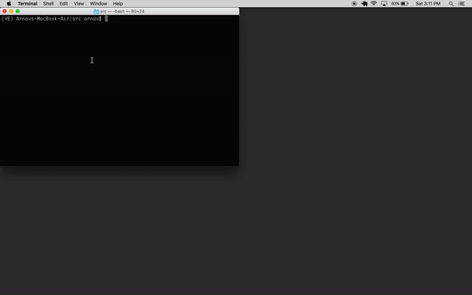

# Reddgram

**Reddgram** is a bot which extracts posts from any subreddit on Reddit and uploads it to the linked Instagram account.

Data extraction is done using the **praw** library

Memes are posted using the **instapy_cli** library

Usage:
------
* Clone this repository
```
git clone https://github.com/arnavkohli/Reddgram.git
```
* Start a new virtual environment (__For reference__: https://uoa-eresearch.github.io/eresearch-cookbook/recipe/2014/11/26/python-virtual-env/)

* Add the **src** file of this repo to your new environment (same directory as **bin**, **include**, **lib**)

* Navigate to the **_main.py_** file in **src** directory:

Inside **_main.py_**

* Replace values with your login credentials for both platforms.
* Add subreddits to the **SUBREDDITS** variable. The bot will randomly choose a subreddit, extract a post from that subreddit and upload it to Instagram.

```
from Reddgram import Reddgram

client_id       ="(Reddit client ID here)"
client_secret   ="(Reddit security ID here)"
password        ="(Reddit password here)"
user_agent      ="(Reddit user agent here)"
username        ="(Reddit username)"

ig_username = "(Instagram handle here)"
ig_password = "(Instagram password here)"

rg = Reddgram(CLIENT_ID=client_id,
                    SEC_ID=client_secret,
                    PASSWORD=password,
                    USERAGENT=user_agent,
                    USERNAME=username,
                    IG_USERNAME=ig_username,
                    IG_PASSWORD=ig_password,

                    SUBREDDITS=['ProgrammerHumour', 'programmingmemes', 'shittyprogramming']

                    )
rg.run()
```
* Activate your virtual environment
* Run the below command to install all the dependencies:

```
pip install -r requirements.txt
```

* Navigate to the **src** directory and run the following command in the terminal:

```    
python main.py
```



* The **cache.json** file stores the IDs of the posts which have already been posted. Before posting to Instagram, the bot checks wether the post ID is in the cache or not. If it is, it moves on to the next post on the same subreddit. If it isn't, the bot uploads the post to Instagram.

* **_Cleaner.py_** cleans the garbage files which were downloaded (if any) in the case of a post failing to be uploaded.

Contribute:
----------

- Issue Tracker: https://github.com/arnavkohli/Reddgram/issues
- Source Code  : https://github.com/arnavkohli/Reddgram

Support:
-------

If you are having issues, please let me know at arnavkohli@gmail.com

License:
-------

The project is licensed under the MIT license.

